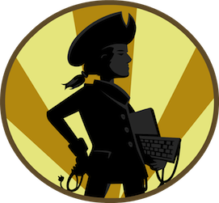

### What

MassHackers is a monthly meeting for hackers of all kinds to share the projects they're working on, and to learn about the projects of others. If this interests you, check out our [about page](/masshackers.com/about.html) for a full explanation.

Details about our previous and upcoming meetings can be found in the [archive](/masshackers.com/archive.html).

### Where

The [Red Hat](http://redhatboston.com/) in Boston, MA, USA (near Government Center).

### When

Monthly meetings are held on the 2nd Wednesday of every month.      

MassHackers Logo by [Rachel Maguire](http://www.rayarray.com/) is licensed under a [Creative Commons Attribution-Noncommercial-No Derivative Works 3.0 United States License](http://creativecommons.org/licenses/by-nc-nd/3.0/us/).
